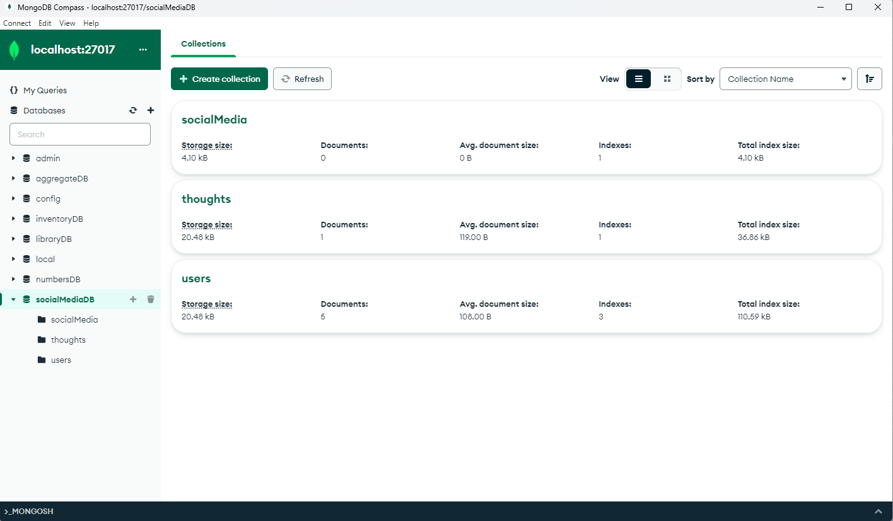
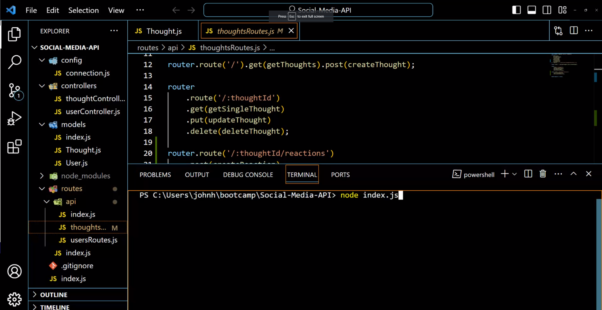
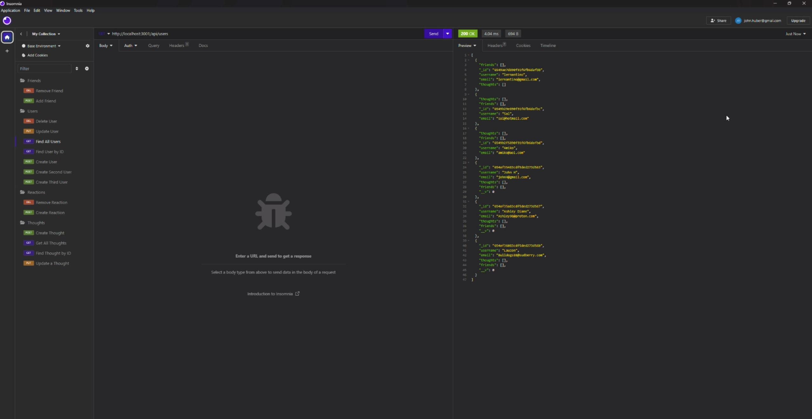

# Social-Media-API

## Description

This Social Media API was a great experience and taught me a lot about NoSQL server side coding. I had much to learn when it came to using routes effectively and creating models to manipulate my data through a MongoDB Database with the helping program of Mongoose. This project allowed me to gain experience in creating back-end databases in another fashion which will help me grow and experience new horizons in this technological frontier. A MongoDB is considered to be a bit more agile and reflexive than traditional server-side coding by allowing all the elements to be focused in models and allows for that model to be manipulated in segmented pages via the controllers. This was also a great test in following how routes work to get information to the view side by working step-by-step and following the route from the index, to the route index, to the api index and then from there to the specific routes needed for each set of information.

## Installation

For this particular program, you will need to go to [Github](www.github.com)

 and clone the code from the repository. From there, you will clone it into your code editor of choice and then install the necessary packages with `nmp i`. These packages include mongoose to assist MongoDB, Dayjs to give timestamps, Express.js to help with routing, and nodemon to keep your server running with updates. You will also need Insomnia or its equivalent and MongoDB. 

## Usage

Once all those programs are installed and running, you will run the command index.js in the integrated terminal of your code editor to make the server go live.

 From there, you will open Insomnia and manipulate the data according to their appropriate routes!

## Credits

I had lots of help from my classmates and instructors at the UCLA Bootcamp. I also relied heavily on the X-pert Learner for this particular project to help me with large things (like attempting to understand how the friends routes work) as well as small things (forgotten brackets or the errant comma). I also wanted to thank the helpers at the AskBCS team who helped me understand where parts of my code needed work and help.

A link to my walk-through video on GoogleDrive: https://drive.google.com/file/d/18JNLxkt7Bt831kxXKCpZWL-sJ_eohp-h/view
